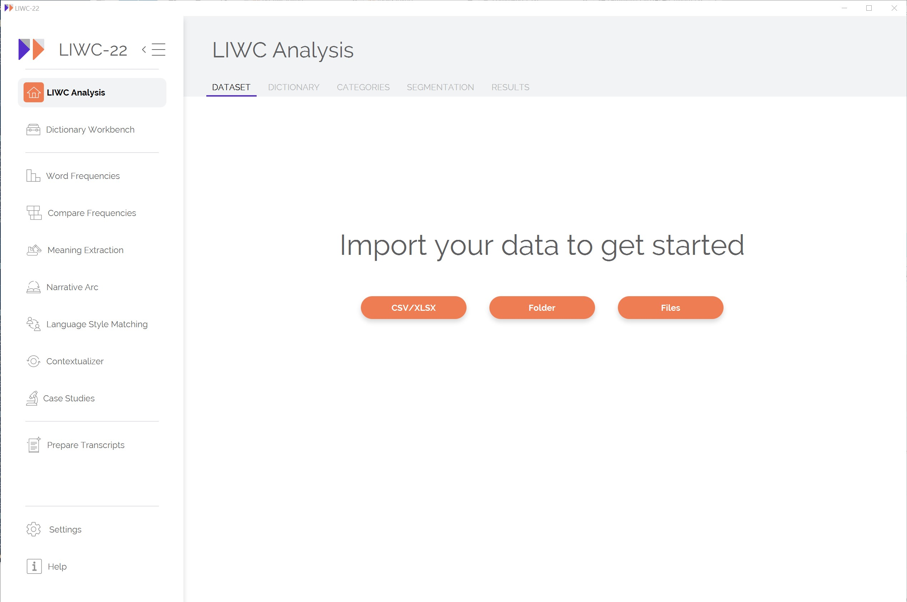
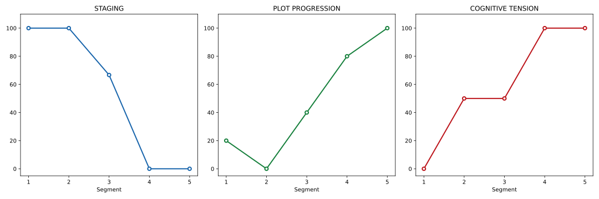

# How to use


<!-- WARNING: THIS FILE WAS AUTOGENERATED! DO NOT EDIT! -->

## Initialization

[`Liwc`](https://camille1.github.io/pyliwc/core.html#liwc) is the main
class for interacting with the LIWC CLI.

``` python
liwc = Liwc(liwc_cli_path='LIWC-22-cli', threads=None, verbose=True) 
```

**Parameters**: - liwc_cli_path (str): Path to the LIWC CLI executable.
Default is ‘LIWC-22-cli’. On WSL, it is required to add .exe at the end
‘LIWC-22-cli.exe’, - threads (int, optional): Number of threads to use.
Defaults to the number of CPU cores minus one. - verbose (bool,
optional): If True, display printing such as progress bar for large
files. Defaults to False.

The main Class of `Pyliwc` is
[`Liwc`](https://camille1.github.io/pyliwc/core.html#liwc).

<div class="alert alert-info">

Note: Pyliwc requires that the LIWC-22 application is running on your
computer. Please ensure that you currently have a copy of the LIWC-22
user interface open.

</div>

<!--  -->


## Methods

### LIWC analyze

`analyze_df`

Analyze text data from a Pandas DataFrame using LIWC.

``` python

from pyliwc import Liwc

liwc = Liwc('LIWC-22-cli.exe')


result_df = liwc.analyze_df(text_df, return_input=False, liwc_dict='LIWC22')
```

**Example**

``` python
import pandas as pd
data = {'Text': ["I am happy", "I feel sad today"]}
df = pd.DataFrame(data)
result_df = liwc.analyze_df(df.Text)
```

`analyze_csv`

Analyze text data from a CSV file using LIWC.

``` python
liwc.analyze_csv(input_file, output_location, row_id_indices, column_indices, liwc_dict='LIWC22')
```

**Example**

``` python
liwc.analyze_csv("input.csv", "output.csv", "0", "1")
```

`analyze_folder`

Analyze all text files in a specified folder using LIWC.

``` python
liwc.analyze_folder(input_folder, output_location, liwc_dict='LIWC22')
```

**Example**

``` python
liwc.analyze_folder('D:/Downloads/texts_folder', 'D:/Downloads')
```

`analyze_string`

Analyze a single string using LIWC.

``` python
liwc.analyze_string(input_string, output_location, liwc_dict='LIWC22')
```

**Example**

``` python
liwc.analyze_string("I am feeling great", "D:/Downloads")
```

`analyze_string_to_json`

Analyze a single string and return the result as a JSON object.

``` python
liwc.analyze_string_to_json(input_string, liwc_dict='LIWC22')
```

**Example**

``` python
result = liwc.analyze_string_to_json("This is an example string")
print(result)

{'Segment': 1, 'WC': 5, 'Analytic': 39.7, 'Clout': 40.06, 'Authentic': 1, 'Tone': 20.23, 'WPS': 5, 'BigWords': 20, 'Dic': 60, 'Linguistic': 60, 'function': 60, 'pronoun': 20, 'ppron': 0, 'i': 0, 'we': 0, 'you': 0, 'shehe': 0, 'they': 0, 'ipron': 20, 'det': 40, 'article': 20, 'number': 0, 'prep': 0, 'auxverb': 20, 'adverb': 0, 'conj': 0, 'negate': 0, 'verb': 20, 'adj': 0, 'quantity': 0, 'Drives': 0, 'affiliation': 0, 'achieve': 0, 'power': 0, 'Cognition': 0, 'allnone': 0, 'cogproc': 0, 'insight': 0, 'cause': 0, 'discrep': 0, 'tentat': 0, 'certitude': 0, 'differ': 0, 'memory': 0, 'Affect': 0, 'tone_pos': 0, 'tone_neg': 0, 'emotion': 0, 'emo_pos': 0, 'emo_neg': 0, 'emo_anx': 0, 'emo_anger': 0, 'emo_sad': 0, 'swear': 0, 'Social': 0, 'socbehav': 0, 'prosocial': 0, 'polite': 0, 'conflict': 0, 'moral': 0, 'comm': 0, 'socrefs': 0, 'family': 0, 'friend': 0, 'female': 0, 'male': 0, 'Culture': 0, 'politic': 0, 'ethnicity': 0, 'tech': 0, 'Lifestyle': 0, 'leisure': 0, 'home': 0, 'work': 0, 'money': 0, 'relig': 0, 'Physical': 0, 'health': 0, 'illness': 0, 'wellness': 0, 'mental': 0, 'substances': 0, 'sexual': 0, 'food': 0, 'death': 0, 'need': 0, 'want': 0, 'acquire': 0, 'lack': 0, 'fulfill': 0, 'fatigue': 0, 'reward': 0, 'risk': 0, 'curiosity': 0, 'allure': 0, 'Perception': 0, 'attention': 0, 'motion': 0, 'space': 0, 'visual': 0, 'auditory': 0, 'feeling': 0, 'time': 0, 'focuspast': 0, 'focuspresent': 20, 'focusfuture': 0, 'Conversation': 0, 'netspeak': 0, 'assent': 0, 'nonflu': 0, 'filler': 0, 'AllPunc': 0, 'Period': 0, 'Comma': 0, 'QMark': 0, 'Exclam': 0, 'Apostro': 0, 'OtherP': 0, 'Emoji': 0}
```

### Language Style Matching

This method allows the analysis of linguistic style matching, focusing
on person and group-level analysis.

`analyze_lsm`

Perform LSM analysis on a DataFrame.

``` python

liwc.analyze_lsm(df, calculate_lsm='person-and-group', group_column='GroupID', person_column='PersonID', text_column='Text', output_type='pairwise', expanded_output=False, omit_speakers_number_of_turns=0, omit_speakers_word_count=10, segmentation='none')
```

**Example**

``` python
liwc = Liwc('LIWC-22-cli.exe')
import pandas as pd

# Example DataFrame
data = {
    'GroupID': [1, 1, 2, 2],
    'PersonID': [101, 102, 201, 202],
    'Text': ["I like apples",
             "He enjoys oranges",
             "They eat bananas",
             "We love grapes"]
}
df = pd.DataFrame(data)

lsm_result = liwc.analyze_lsm(df,
                              calculate_lsm="pairwise",  
                              person_column='PersonID',
                              group_column='GroupID',
                              text_column='Text',
                              omit_speakers_word_count=1)
```

``` python
# Group level
lsm_result['group_level']
```

<table border="1" class="dataframe">

<thead>

<tr style="text-align: right;">

<th>

</th>

<th>

GroupID
</th>

<th>

Segment
</th>

<th>

LSM
</th>

<th>

WC.Total
</th>

</tr>

</thead>

<tbody>

<tr>

<th>

0
</th>

<td>

1
</td>

<td>

1
</td>

<td>

0.88
</td>

<td>

6
</td>

</tr>

<tr>

<th>

1
</th>

<td>

2
</td>

<td>

1
</td>

<td>

1.00
</td>

<td>

6
</td>

</tr>

</tbody>

</table>

``` python
# Person level
lsm_result['person_level']
```

<table border="1" class="dataframe">

<thead>

<tr style="text-align: right;">

<th>

</th>

<th>

GroupID
</th>

<th>

Segment
</th>

<th>

Person.1
</th>

<th>

Person.2
</th>

<th>

LSM
</th>

<th>

WC.Person.1
</th>

<th>

WC.Person.2
</th>

</tr>

</thead>

<tbody>

<tr>

<th>

0
</th>

<td>

1
</td>

<td>

1
</td>

<td>

101
</td>

<td>

102
</td>

<td>

0.88
</td>

<td>

3
</td>

<td>

3
</td>

</tr>

<tr>

<th>

1
</th>

<td>

2
</td>

<td>

1
</td>

<td>

201
</td>

<td>

202
</td>

<td>

1.00
</td>

<td>

3
</td>

<td>

3
</td>

</tr>

</tbody>

</table>

### Narrative arc

The Narrative Arc Analysis feature provides insights into the narrative
structure of texts by breaking them down into key components such as
Staging, Plot Progression, and Cognitive Tension. This is particularly
useful for understanding the flow and development of stories or
articles. Here’s a closer look at how it works:

**How It Works**

1.  Text Segmentation:

    - The text is divided into multiple segments, and each segment is
      analyzed separately.

    - You can control the number of segments using the segments_number
      parameter.

2.  Components Analysis:

    - **Staging**: This measures how much information is being set up at
      various points in the text.
    - **Plot Progression**: This reflects the movement and development
      of the narrative.
    - **Cognitive Tension**: This captures the emotional or
      psychological tension present in the text.

3.  Scaling Methods: Two scaling methods are available:

    - `0-100`: Values are scaled between 0 and 100 for easy comparison.
    - `Z-score`: Standardizes scores based on mean and standard
      deviation.

4.  Output Options:

    - Choose whether to output individual data points for each segment
      or aggregate the data.
    - Filter out texts with word counts below a specified threshold
      using skip_wc. Function Usage

Here is a breakdown of the narrative_arc function, which conducts the
analysis:

`narrative_arc`

``` python


narrative_arc(
    df=df, 
    column_names=['Text'], 
    output_individual_data_points=True, 
    scaling_method='0-100', 
    segments_number=5, 
    skip_wc=10
)
```

**Example**

``` python

from pyliwc import Liwc
import pandas as pd

liwc = Liwc('LIWC-22-cli.exe')

df = pd.DataFrame({
    'Text': ["""
Once upon a time, in a land far away, there lived a young prince named Elior who was born without the ability to speak. One day, a wise inventor arrived at the castle with an AI device that could translate thoughts into speech. The prince accepted the device and, to everyone's amazement, his unspoken words became a beautiful voice. The entire kingdom rejoiced as Elior expressed his wisdom and compassion. With the power of AI, he not only found his voice but also united his people. Thus, the prince and his kingdom thrived, forever grateful for the miracle of technology."""
    ]
})


narrative_results = liwc_analyzer.narrative_arc(
    df=df, 
    column_names=['Text'], 
    output_individual_data_points=True, 
    scaling_method='0-100', 
    segments_number=5, 
    skip_wc=10
)
```

``` python

narrative_results
```

<table border="1" class="dataframe">

<thead>

<tr style="text-align: right;">

<th>

</th>

<th>

Row ID
</th>

<th>

WC
</th>

<th>

Narrativity_Overall
</th>

<th>

Narrativity_Staging
</th>

<th>

Narrativity_PlotProg
</th>

<th>

Narrativity_CogTension
</th>

</tr>

</thead>

<tbody>

<tr>

<th>

0
</th>

<td>

1
</td>

<td>

100
</td>

<td>

47.6
</td>

<td>

81.09
</td>

<td>

16.17
</td>

<td>

45.54
</td>

</tr>

</tbody>

</table>

``` python

liwc = Liwc('LIWC-22-cli.exe')

df = pd.DataFrame({
    'Text': ["""
Once upon a time, in a land far away, there lived a young prince named Elior who was born without the ability to speak. One day, a wise inventor arrived at the castle with an AI device that could translate thoughts into speech. The prince accepted the device and, to everyone's amazement, his unspoken words became a beautiful voice. The entire kingdom rejoiced as Elior expressed his wisdom and compassion. With the power of AI, he not only found his voice but also united his people. Thus, the prince and his kingdom thrived, forever grateful for the miracle of technology."""
    ]
})


narrative_results = liwc.narrative_arc(
    df=df, 
    column_names=['Text'], 
    output_individual_data_points=True, 
    scaling_method='0-100', 
    segments_number=5, 
    skip_wc=10
)
```

### Plotting the Narrative Arc

To visually represent the narrative arc, you can use the
plot_narrative_arc method:

Note: `output_individual_data_points` must be set to `True` in
`narrative_arc` to plot the results

``` python

from pyliwc import Liwc
import pandas as pd

liwc = Liwc('LIWC-22-cli.exe')

df = pd.DataFrame({
    'Text': ["""
Once upon a time, in a land far away, there lived a young prince named Carlo who was born without the ability to speak.
One day, a wise inventor arrived at the castle with an AI device that could translate thoughts into speech. 
The prince accepted the device and, to everyone's amazement, his unspoken words became a beautiful voice. 
The entire kingdom rejoiced as Elior expressed his wisdom and compassion.
With the power of AI, he not only found his voice but also united his people. 
Thus, the prince and his kingdom thrived, forever grateful for the miracle of technology."""
    ]
})


narrative_results = liwc.narrative_arc(
    df=df, 
    column_names=['Text'], 
    output_individual_data_points=True, 
    scaling_method='0-100', 
    skip_wc=10
)

#  Plot the Narrative Arc

fig = liwc.plot_narrative_arc(narrative_results)
fig
```


